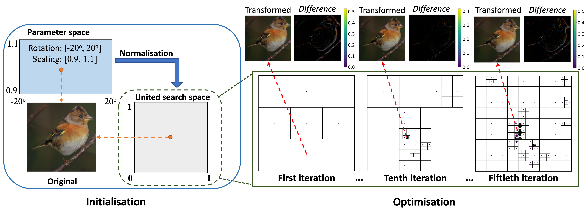

# GeoRobust: Towards Verifying the Geometric Robustness of Large-scale Neural Networks (AAAI 2023)

## Abstract
Deep neural networks (DNNs) are known to be vulnerable to adversarial geometric transformation. This paper aims to verify the robustness of large-scale DNNs against the combination of multiple geometric transformations with a provable guarantee. Given a set of transformations (e.g., rotation, scaling, etc.), we develop GeoRobust, a black-box robustness analyser built upon a novel branch-and-bound search strategy, for determining the worst-case combination of transformations that affect and even alter a network’s output. GeoRobust can provide provable guarantees on finding the worst-case combination based on recent advances in Lipschitzian theory. Due to its black-box nature, GeoRobust can be deployed on large-scale DNNs regardless of their architectures, activation functions, and the number of neurons. Furthermore, with the proposed parallelisation strategy, on average, GeoRobust takes only 10 seconds to locate the worst-case geometric transformation for ResNet model on ImageNet. We systematically examine 18 ImageNet classifiers, including ResNet family and vision transformers. Our experiments reveal a positive correlation between the geometric robustness of the networks and the parameter numbers. We also observe that increasing the depth of DNN is more beneficial than increasing its width in terms of improving its geometric robustness.

## Pipeline
GeoRobust is composed of four components: 

1. a Lipschitz continuous module for performing geometric transformations;
2. a space division procedure; 
3. a mechanism to select Potential Optimal subspaces that are more likely to contain the global minimum points than others; 
4. and an anytime estimation of the global minimum.

<p align="center">
    
</p>


## Requirement

Our method is developed with Python==3.8, pytorch==1.11.0, and torchvision==0.12.0. 
To load pretrained ImagreNet classifiers, we used [TIMM](https://github.com/rwightman/pytorch-image-models)==0.5.4. 
Autograd==1.3 is required to run the small demo provided with the algorithm for result checking.

## How to use

We provide some shell scripts to reimplement the experiments in our paper. Please check and update the path variables in these scripts before using them.

```bash
# Benchmark on ImageNet classifiers shown in Table 3, run
sh shell/benchmarking_imagenet.sh 

# Comparison reported in Table 2, run
sh shell/baseline_gridsearch_imagenet.sh 
sh shell/baseline_randompick_imagenet.sh 
sh shell/ours_georobust_imagenet.sh 
```
For comparison reported in Table 1, please check `shell/tss_cifar.sh` and `shell/tss_mnist.sh`.

## Citation
```
@misc{WangXRH23,
  author = {Wang, Fu and Xu, Peipei and Ruan, Wenjie and Huang, Xiaowei},
  title = {Towards Verifying the Geometric Robustness of Large-scale Neural Networks},
  url = {https://arxiv.org/abs/2301.12456},
  year = {2023},
}
```

-- Fu Wang & Wenjie Ruan
