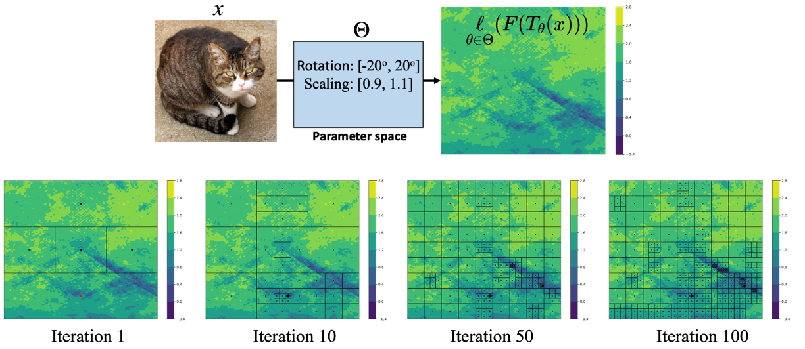

# Manual


## A Demonstration of Using the Global Optimisation Solver
Taking Beale's function as an example, we provide a simple demonstration to validate the correctness of the global optimisation solver that we developed within GeoRobust. The objective function is expressed as:

$ f(x,y) = (1.5 - x+xy)^2 + (2.25-x+xy^2)^2 + (2.625 - x +xy^3)^2, $

where the domain is $-4.5\leq x,y\leq4.5$, and the known minimum value is $f(3,0.5)=0$.
Such a problem can be formulated as the following function:
```python
def demo_problem(x_ins):
    values = []
    for x_in in x_ins:
        x1,x2 = x_in[0],x_in[1]
        value = (1.5 - x1 + x1*x2)**2 \
              + (2.25 - x1 + x1*x2**2)**2 \
              + (2.625 - x1 + x1*x2**3)**2
        values.append(value)
    return np.array(values)
```


To solve the problem, first define the solver as below.
```python
b = [[-4.5,4.5],[-4.5,4.5]] # The domain of our variables.

solver = LowBoundedDIRECT(demo_problem, 2, b, max_deep=20, \
max_feval=4000, tolerance=1e-1, max_iter=100, debug=False)
```
Next, execute the following code to actually run the solver.
```
solver.solve()
print(solver.optimal_result())
```
The output is 
```
[2023/05/29 21:29:26] - [-] 1 th iter: Global minimum: 2.953125 (estimated lower bound: -192.796875). Number of funcation evaluation: 5, found largest slope: 21.75
[2023/05/29 21:29:26] - [-] 2 th iter: Global minimum: 2.953125 (estimated lower bound: -7415.296875). Number of funcation evaluation: 7, found largest slope: 2472.749999999998
...
[2023/05/29 21:29:28] - [-] 99 th iter: Global minimum: 0.000000 (estimated lower bound: -0.000256). Number of funcation evaluation: 2327, found largest slope: 32996.25
[2023/05/29 21:29:28] - [-] 100 th iter: Global minimum: 0.000000 (estimated lower bound: -0.000085). Number of funcation evaluation: 2371, found largest slope: 32996.25
[2.99999996 0.49999999]
```
Please note that the ***demo_problem*** can be replaced with various functions and tasks, such as verifying a specific property of a neural network.


## Use Case on Verifying the Geometric Robustness
To verify the geometric perturbation, we have 
```bash
python imagenet_main.py --timm-model --cw \
                        --example-idx <example_index>\
                        --angle <rotation_angle> \
                        --shift <tranlation_num_pixel> \
                        --scale <scaling_factor> \
                        --max-iteration <num_iterion> \
                        --max-deep <depth> \
                        --max-evaluation <num_query> \
                        --model-name <model_name> --data-dir <path>
```

For geometric perturbations, ***<rotation_angle>***, ***<tranlation_num_pixel>***, and ***<scaling_factor>*** give the range of the corresponding transformation;
***--cw*** tells the program to use the margin loss;
***\<path>*** tells the program where the dataset is, and ***<example_index>*** is the index of the example in the dataset; 
***<model_name>*** refer to the target model, while ***--timm-model*** tells the program to load the model from TIMM;
***<num_iterion>***, ***\<depth>***, and ***<num_query>*** are the computational budget of solving the verification problem.

Considering verifying the geometric robustness against rotation and scaling on a photo of a Tabby cat, the optimisation process can be visualised as follows.

<p align="center">
    
</p>